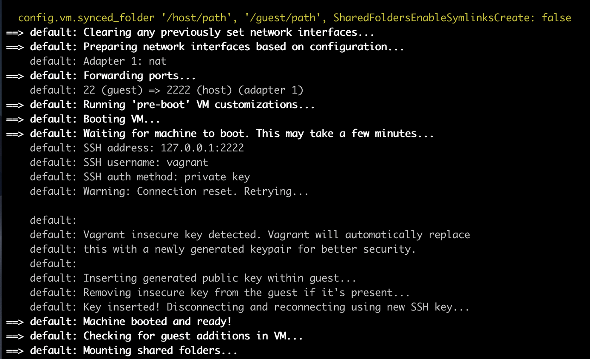

# Installation and running workloads

## Verify Account

- An AWS Account with access to us-east-1 region

- Allow-listed AWS AccountID to test the beta feature

- Check with your Account PDM, or email `isv-container-partners@amazon.com` if you find you are having installation trouble, or lacking this whitelisting access required.

----

## Prerequisite Software

- [Vagrant](https://www.vagrantup.com/downloads)
- [VirtualBox](https://www.virtualbox.org/wiki/Downloads)
- [AWSCLI](https://docs.aws.amazon.com/cli/latest/userguide/install-cliv2.html)

**For OSX users:**

```bash
brew install --cask virtualbox
brew install --cask vagrant
```

----

## Set Launch variables

**Change the name of the Clustername and Servicename if desired, or running multiple tests.**

```bash
export AWS_DEFAULT_REGION=us-east-1
export ROLE_NAME=ecsMithrilRole
export CLUSTER_NAME=test-ecs-anywhere
export SERVICE_NAME=test-ecs-anywhere-svc
```

----

## Create the IAM role

**Either use the `ssm-trust-policy.json` in the base dir of the bundle, or create your own**

```bash
aws iam create-role --role-name $ROLE_NAME --assume-role-policy-document file://ssm-trust-policy.json
aws iam attach-role-policy --role-name $ROLE_NAME --policy-arn arn:aws:iam::aws:policy/AmazonSSMManagedInstanceCore
aws iam attach-role-policy --role-name $ROLE_NAME --policy-arn arn:aws:iam::aws:policy/service-role/AmazonEC2ContainerServiceforEC2Role
# Verify
aws iam list-attached-role-policies --role-name $ROLE_NAME
```

----

## Create ECS Anywhere Cluster and VM

```bash
# Create ECS Cluster
aws ecs create-cluster --cluster-name $CLUSTER_NAME

# Create activation Key
aws ssm create-activation --iam-role $ROLE_NAME | tee ssm-activation.json

#Launch Vagrant 
vagrant up

# ssh to vagrant box
vagrant ssh
```



You should see something like this when spinning up.

---

## Install Required software on Vagrant Box

**Change the `Activation_ID` and `ACTIVATION_CODE` with the ones generated in the previous steps**

```bash
# Run all commands on the vagrant machine
export ACTIVATION_ID=<<ACTIVATION_ID>>
export ACTIVATION_CODE=<<ACTIVATION_CODE>>

# Download the ecs-anywhere install Script 
curl -o "ecs-anywhere-install.sh" "https://amazon-ecs-agent-packages-preview.s3.us-east-1.amazonaws.com/ecs-anywhere-install.sh" && sudo chmod +x ecs-anywhere-install.sh

# (Optional) Check integrity of the shell script
curl -o "ecs-anywhere-install.sh.sha256" "https://amazon-ecs-agent-packages-preview.s3.us-east-1.amazonaws.com/ecs-anywhere-install.sh.sha256" && sha256sum -c ecs-anywhere-install.sh.sha256

# Run the install script
sudo ./ecs-anywhere-install.sh \
    --cluster test-ecs-anywhere \
    --activation-id $ACTIVATION_ID \
    --activation-code $ACTIVATION_CODE \
    --region us-east-1 
```

Validate that installation was success. After the exit the SSH session by running `exit`.

Verify that the instances are connected and running.

```bash
aws ssm describe-instance-information
aws ecs list-container-instances --cluster $CLUSTER_NAME
```
