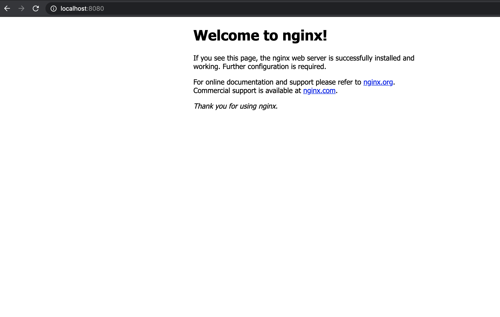

# ECS Task

## Create roles and attach IAM policies

```bash
aws iam --region $AWS_DEFAULT_REGION create-role --role-name ecsanywhereTaskExecutionRole --assume-role-policy-document file://task-execution-assume-role.json

# Add the policy to the execution role
aws iam --region $AWS_DEFAULT_REGION attach-role-policy --role-name ecsanywhereTaskExecutionRole --policy-arn arn:aws:iam::aws:policy/service-role/AmazonECSTaskExecutionRolePolicy

# Create the task role
aws iam --region $AWS_DEFAULT_REGION create-role --role-name ecsanywhereTaskRole --assume-role-policy-document file://task-execution-assume-role.json    
```

## Register Task Definition, and Run Tasks

```bash
#Register the task definition
aws ecs register-task-definition --cli-input-json file://external-task-definition.json

#Run the task
aws ecs run-task --cluster $CLUSTER_NAME --launch-type EXTERNAL --task-definition nginx

#Get the Task ID
TEST_TASKID=$(aws ecs list-tasks --cluster $CLUSTER_NAME | jq -r '.taskArns[0]')

#Verify Task is Running
aws ecs describe-tasks --cluster $CLUSTER_NAME --tasks $TEST_TASKID
```

----

## Verify tasks

If running the basic example with NGINX we enabled port forwarding in the Vagrant file.

```bash
    config.vm.network "forwarded_port", guest: 8080, host: 8080
```

We should be able to go to `http://localhost:8080` now and see nginx running locally.



----

## Stop ECS Task

Next we will test ECS service, but we first want to delete the ECS task for our tests.

```bash
#Tell ECS to stop the task
aws ecs stop-task --cluster $CLUSTER_NAME --task $TEST_TASKID

#Verify all tasks are gone
aws ecs list-tasks --cluster $CLUSTER_NAME

{
    "taskArns": []
}
```
